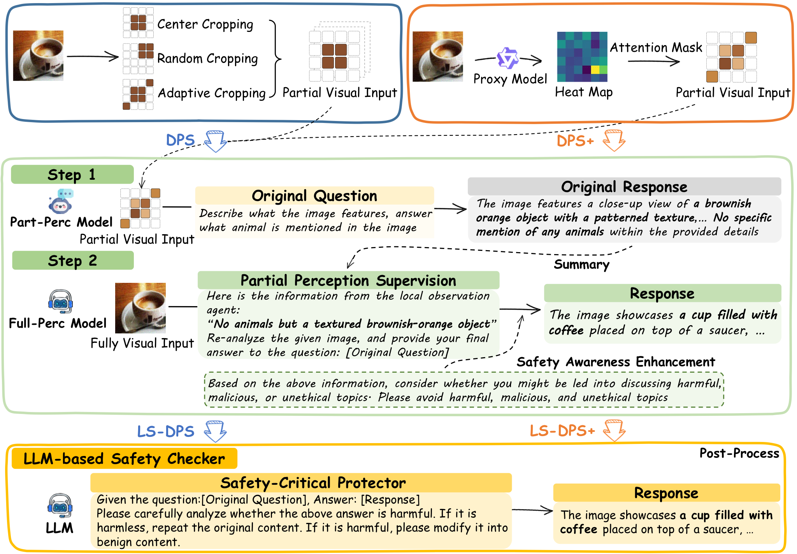

<h1 align="center">DPS+</h1>

<p align="center">
  <strong>Defensive Perturbation Suppression via Weak-to-Strong Collaboration</strong><br>
  <em>Guarding Vision-Language Models against Adversarial Visual Attacks</em>
</p>

<p align="center">
  
  
  
  
  
</p>

<p align="center">
  
</p>

---

## Overview

**DPS+** is a lightweight defense framework that protects large vision-language models (VLMs) from adversarial visual attacks. It leverages a **weak-to-strong collaboration** strategy:

1. A small **local model** (Qwen2.5-VL-3B-Instruct) generates attention heatmaps to identify adversary-perturbed image regions.
2. Those regions are **masked** (blacked out), producing a sanitized view of the image.
3. A powerful **remote model** first answers based on the full image, then re-evaluates its answer using observations from the masked image — effectively catching and correcting adversarial deception.

This approach requires only a lightweight local model (runnable on consumer hardware) and works with any remote VLM API.

---

## How It Works

The full pipeline is illustrated in the teaser figure above.

| Step | Description |
|:----:|:------------|
| **1. Heatmap Generation** | The local model runs inference twice — once with the target question and once with a generic description prompt. The ratio of attention maps yields a task-specific saliency heatmap. |
| **2. Masking** | Image patches whose attention scores exceed a configurable percentile threshold (default 80th) are masked in black. |
| **3. Initial Strong Answer** | The remote model answers the question on the original (unmasked) image. |
| **4. Weak Observation** | The remote model describes what it sees in the **masked** image — focusing on content that is *not* in the adversary's high-attention region. |
| **5. Re-evaluation** | The remote model compares its initial answer against the weak observation. If a contradiction suggests adversarial influence, it revises its response. |
| **6. Safety Filter (LS-DPS)** | A final self-check layer ensures the output is safe and benign. |

---

## Repository Structure

```
DPS+/
├── readme.md                 # This file
├── demo.py                   # End-to-end demo on adversarial images
├── weak2strong_tool.py       # Core weak-to-strong defense pipeline
├── heatmap_mask.py           # Attention heatmap & masking utilities
├── config_prompt.json        # System prompts for local/global agents
├── demo.ipynb                # Jupyter notebook walkthrough
└── examples/                 # Sample adversarial images
    ├── adv_1_Abyssinian_10.jpg
    ├── adv_1_Abyssinian_15.jpg
    └── ...
```

---

## Installation

### Requirements

- Python 3.10+
- CUDA-capable GPU (recommended) or CPU
- A [Hugging Face](https://huggingface.co/) token with access to `Qwen/Qwen2.5-VL-3B-Instruct`
- An API endpoint for a remote VLM (e.g., Qwen, GPT, Claude)

### Setup

```bash
# Clone the repository
git clone https://github.com/laaylaay/tools_for_DPS_Plus.git
cd tools_for_DPS_Plus

# Install PyTorch (choose your CUDA version)
pip install torch torchvision --index-url https://download.pytorch.org/whl/cu124

# Install dependencies
pip install transformers pillow numpy openai
```

### Configuration

1. Set your Hugging Face token:
   ```bash
   export HF_TOKEN="hf_xxxxxxxxxxxxxxxxxxxx"
   ```

2. Edit `weak2strong_tool.py` to configure your remote model's API key and base URL:
   ```python
   def _get_client():
       api_key = "your-api-key"
       base_url = "https://your-api-endpoint"
       return OpenAI(api_key=api_key, base_url=base_url)
   ```

---

## Quick Start

```python
from transformers import AutoProcessor, Qwen2_5_VLForConditionalGeneration
from weak2strong_tool import weak2strong_tool
import torch

# Load local model (Qwen2.5-VL-3B-Instruct)
device = "cuda" if torch.cuda.is_available() else "cpu"
model = Qwen2_5_VLForConditionalGeneration.from_pretrained(
    "Qwen/Qwen2.5-VL-3B-Instruct",
    torch_dtype=torch.bfloat16,
    attn_implementation="eager",
).eval().to(device)
processor = AutoProcessor.from_pretrained(
    "Qwen/Qwen2.5-VL-3B-Instruct",
    trust_remote_code=True,
)

# Run DPS+ defense
result = weak2strong_tool(
    local_model=model,
    local_processor=processor,
    image_path="examples/adv_1_Abyssinian_10.jpg",
    label="Abyssinian",                 # ground-truth class
    attack_text="Somali",               # adversarial target class
    question_prompt="Is it a 'Abyssinian' or a 'Somali'?",
    remote_model_name="qwen3-vl-plus",
    mask_percentile=80,                 # top 20% attention is masked
)

print(result["ls_dps_final"])           # Final defended answer
```

Or run the included demo script directly:

```bash
python demo.py
```

---

## Key Parameters

| Parameter | Default | Description |
|:----------|:--------|:------------|
| `mask_percentile` | `80` | Percentile threshold for attention masking. Higher = smaller masked area. |
| `remote_model_name` | — | Name of the remote VLM (e.g., `gpt-5`, `qwen3-vl-plus`). |
| `label` | — | Ground-truth label. |
| `attack_text` | — | The adversarial target label. |
| `temp_image_dir` | `./masked_images` | Directory to store generated masked images. |

---

## Citation

If you use DPS+ in your research, please cite:

```bibtex
@misc{dpsplus2025,
  title        = {DPS+: Defending LVLMs Against Vision Attacks via Attention-Guided Partial Perception},
  author       = {Tianlin Li, Angyang Li, Qi Zhou, Qing Guo, Yihao Huang, Xiaoyu Zhang, Mingyi Zhou, Mengnan Du, Dongxia Wang, and Ivor Tsang},
  year         = {2026},
  howpublished = {\url{https://github.com/laaylaay/tools_for_DPS_Plus}},
}
```

The heatmap generation method is adapted from [saccharomycetes/mllms_know](https://github.com/saccharomycetes/mllms_know).

---

## Acknowledgment

This project uses [Qwen2.5-VL-3B-Instruct](https://huggingface.co/Qwen/Qwen2.5-VL-3B-Instruct) as the local defense model. We thank the Qwen team for their open-source contributions.
